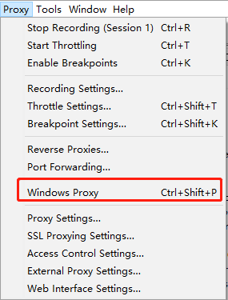
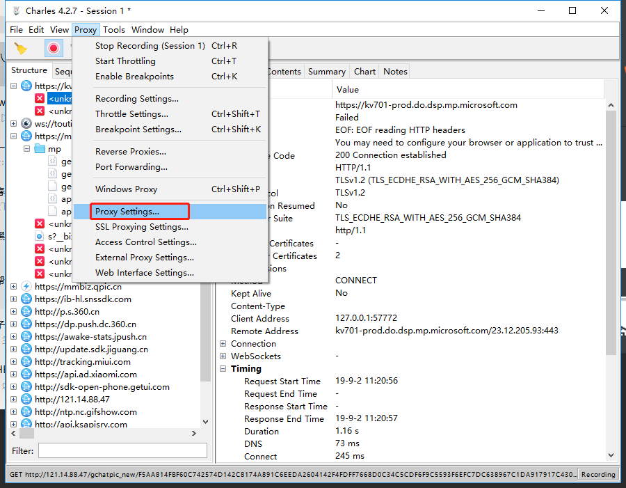
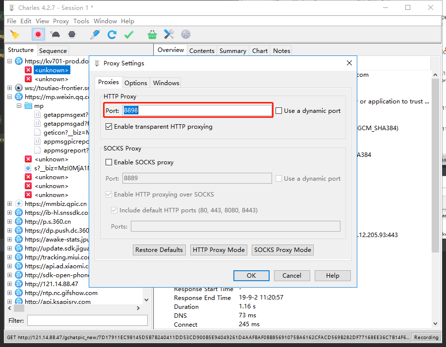
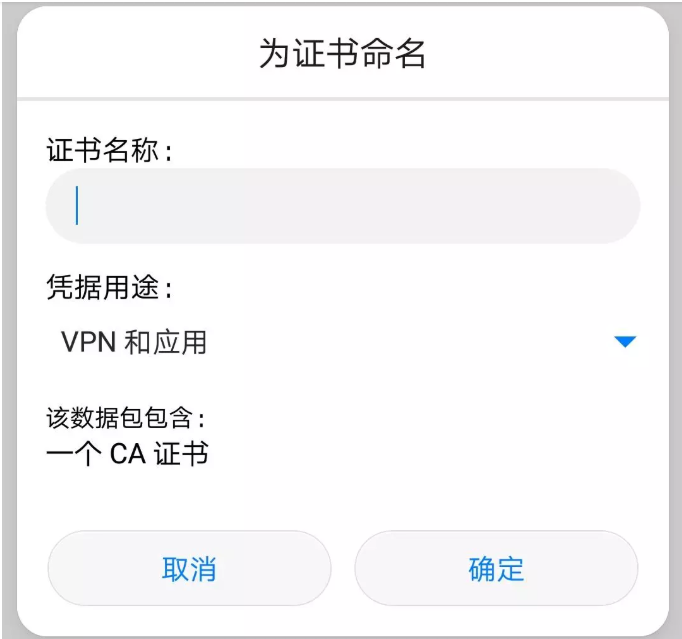

## 破解
资源地址：

# 重点
## ssl设置
## 证书安装

https://pan.baidu.com/s/12lJ0QMldGce4swqTmdmEuA#list/path=%2F

## 1. 电脑证书信任
安装：
客户端help->SSL Proxying->install Charles Root Certificate
信任：
在钥匙串中找到Charles Proxy CA这个证书，信任它
## 2. 手机证书信任
安装：

客户端help->SSL Proxying->install Charles Root Certificate on a Mobile Device or Remote Browser,显示“Configure your device to use Charles as its HTTP proxy on 192.168.2.1:8888, then browse to chls.pro/ssl to download and install the certificate.”，在手机浏览器上输入“chls.pro/ssl”去下载证书并安装
## 3. 客户端设置

1）使用代理设置

点击Proxy->Proxy Settings

勾选 Enable tranaparent HTTP proxying

勾选 Enable SOCKS proxy

2）抓取端口设置

点击Proxy->SSL Proxy Settings

勾选Enable SSL Proxying

点击Add，添加抓取端口（*:443默认为全部端口）

## 证书安装
https://www.jianshu.com/p/703998ae4e78
## 去掉 window-pc 抓包

## 设置代理端口

## 手机客户端设置

- 下载证书
- 修改证书名称后缀为 crt
- 点击证书安装

- 安装

